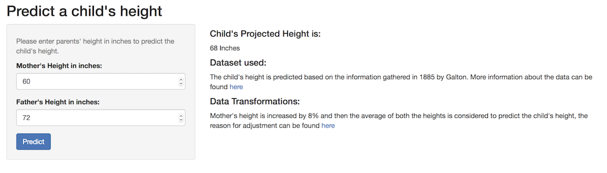

## Introduction

* Predicting a child's height has always been a challenging statistical question that many researchers tried to find a solution to. 
* As an attempt to use one such algorithm and provide a means for users to predict a child's height based on the Parents' height, an app is developed.
* This App uses a dataset(Galton) provided by one of the R-Packages (UsingR) to build a model that can be used to predict the height of a child.
* More information about the dataset can be found here (http://www.inside-r.org/packages/cran/UsingR/docs/galton)

The app is accessible here (https://mallesh.shinyapps.io/height_prediction/)

--- .class #id 

## App - Details

* The above screenshot shows simplicity of the app and inidcates various input and output fields.
* Once we enter the mother and father's height in inches, the child's height is predicted in inches and displayed on left side.

--- .class #id 

## Data Transformations

* The dataset (galton) has two variables, child's height and a Parent's height.
* Following logic is used to calculate the Parent's height:
  Parents' height = (father's Height + mother's height + 1.08)/2
* As one can observe the mother's height is adjusted by increasing it by 8%. This is due to the fact that a women's height is observed to be 8% shorter in general. More information can be found here (http://chance.amstat.org/2013/09/1-pagano/)

--- .class #id 

## Final words

* This app helps an end-user to predict a child's height which has always been limited to the researchers and advanced analysts.
* The model can be improved further by gathering ethnic related heights and including ethnicity as an independent variable.

Disclaimer:  This app is developed as part of a course project, so this should not be used for any real life applications. Also, true child's height cannot be predicted with complete accuracy.
